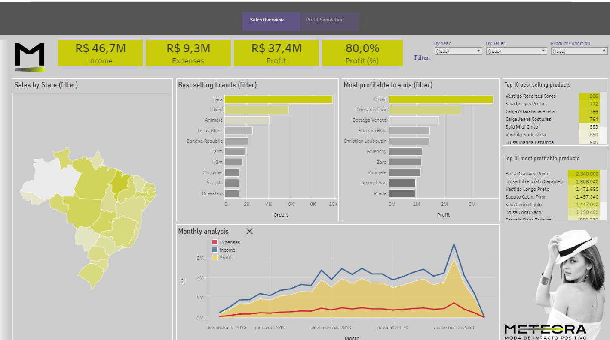
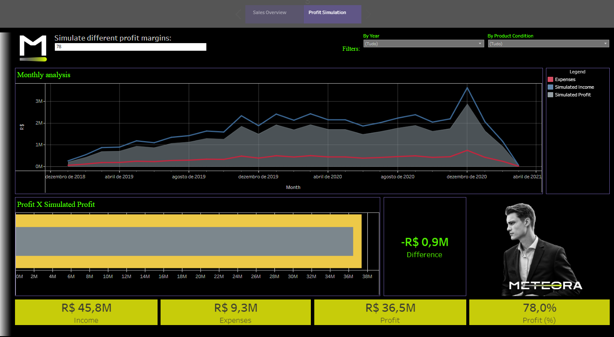

# Meteora - Data Analysis - BI

### Marcos Oliveira (mvoassis@gmail.com)

> Alura's 3rd BI Challenge 

## Problem description

The company Meteora needs to understand how its sales is performing and, based on hypotheses, analyze possible changes in the scenario.

Data contents were made available in an unstructured MySQL dump regarding sales information, as well as the company's visual identity.

The results can be accessed at: [Tableau Dashboard](https://public.tableau.com/app/profile/marcos.assis6468/viz/Challengebisem3/Story1?publish=yes)

## Tools

- Python - Data cleaning.
- Tableau - Data analysis.
- MySQL - Data organization and storage.

## Objectives

Create one or more dashboards that measure:

* Sales by State
* Monthly analysis of the sales trends
* Income, Expenses and Profit
* Simulate different scenarios modifying the profit margin.

The data should be filtered by:

* Year
* Seller
* Product Condition
* State

## Dashboards

2 dashboards were implemented, related to:

1. Sales Overview.
2. Profit Simulation.

### Sales Overview:

In this dashboard, most of the information required in the project objectives (highlighted above) are evaluated.

In this view, the "Best selling brands" and "Most profitable brands" fields can be used as a filter. Thus, it is possible to identify that the "Mixed" brand is the most profitable one, responsible for up to 10\% of the overall income. Furthermore, it is the second most ordered brands, and is specially uneffective on the states of Bahia and Espirito Santo. 

In addition, it can be seen that second-hand products are the majority of the orders. Thus, if the marketing is not focusing on it, they should.

The map of Brazil illustrates the number of orders by state. It can be seen that the states of Maranhão and Distrito Federal concentrate the largest number of orders for the company. In addition, this map also works as a filter, allowing Income, Expenses and Profit to be evaluated by State.

Finally, the "Monthly analysis" plot shows the sales per month from 2019 to 2021. It is possible to see an Income decrease after December, 2020. Using the year filter as 2021, it is possible to see that the States of São Paulo, Sergipe and Pernambuco, which had higher concentration of orders on previous years, are faring worse in this year. 

### Profit Simulation

This dashboard brings additional, allowing to simulate scenarios by adjusting the profit margin (which is currently 80\%). This value can be edited on the top of the dashboard, impacting all the remaining views. 

The monthly analysis shows the sales timeline from 2019 to 2021, which can also be filtered by year or product condition.

The "Profit X Simulated Profit" highlights the difference between the real scenario and the simulated one, and the card "Difference" on its right shows the difference in R$ (brazilian reais) between them. 

Considering that the Expenses remains constant (costs regarding product transportation), it is possible to reduce the profit margin to make the products more atractive to customers while maintaining a good profit margin.

### Possible solutions:

Regarding the Income decrease in 2021, some possible approaches are:

* Increase the marketing effort in São Paulo, Sergipe and Pernambuco States.
* Descrease the profit margin to make the products more attractive to customers, assuring that the profit value always remains higher than the expenses. 
